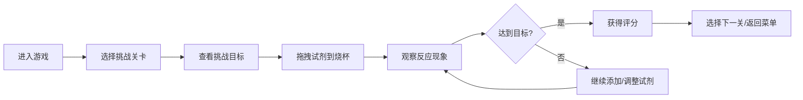
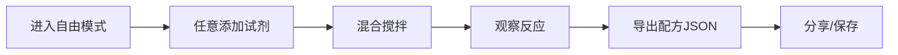

## 1. 产品概述
在线像素风格化学实验室模拟小游戏，让用户在安全的虚拟环境中体验化学实验的乐趣。
- 提供多种常见化学试剂，支持拖拽混合，模拟真实化学反应现象
- 通过挑战关卡和自由模式，寓教于乐地学习化学基础知识

## 2. 核心功能

### 2.1 功能模块
1. **主菜单页面**：游戏入口，模式选择，关卡列表
2. **游戏主界面**：试剂架、烧杯实验区、状态显示面板、操作工具栏
3. **挑战关卡系统**：多个预设挑战目标，评分机制
4. **自由实验模式**：无限制混合，配方导出分享

### 2.2 页面详情
| 页面名称 | 模块名称 | 功能描述 |
|-----------|-------------|---------------------|
| 主菜单页面 | 模式选择 | 切换挑战模式/自由模式，显示关卡列表 |
| 主菜单页面 | 设置面板 | 音效开关、音量调节、像素风格开关 |
| 游戏主界面 | 试剂架 | 展示可用化学试剂，支持拖拽操作 |
| 游戏主界面 | 烧杯实验区 | 核心实验区域，显示溶液、反应动画、粒子效果 |
| 游戏主界面 | 状态面板 | 实时显示pH值、温度、溶液体积、颜色 |
| 游戏主界面 | 工具栏 | 搅拌、倾倒、重置、导出配方等操作按钮 |
| 游戏主界面 | 挑战目标区 | 显示当前挑战目标和完成进度 |
| 挑战结算界面 | 评分展示 | 根据完成度和效率给予星级评价 |

## 3. 核心流程

### 3.1 挑战模式流程

### 3.2 自由模式流程

## 4. 用户界面设计

### 4.1 设计风格
- **像素风格**：8-bit像素艺术风格，所有UI元素采用像素化渲染
- **主色调**：实验室深蓝色 (#1a237e) 作为背景，试剂采用鲜艳的像素色块
- **辅助色**：试管架木质棕色 (#5d4037)，烧杯玻璃浅蓝色 (#81d4fa)
- **按钮风格**：3D像素凸起按钮，按压时有凹陷效果
- **字体**：像素风格等宽字体 (Press Start 2P 或类似字体)
- **图标**：纯像素绘制的化学仪器图标（烧杯、试管、滴管等）

### 4.2 页面设计概述
| 页面名称 | 模块名称 | UI元素 |
|-----------|-------------|-------------|
| 主菜单页面 | 标题区 | 像素艺术Logo，闪烁动画效果 |
| 主菜单页面 | 关卡选择 | 像素化的卡片布局，锁定/解锁状态 |
| 游戏主界面 | 试剂架 | 左侧垂直排列，每个试剂有像素图标和名称标签 |
| 游戏主界面 | 烧杯区 | 中央大烧杯，溶液有动态波纹效果 |
| 游戏主界面 | 状态面板 | 右上角，像素风格仪表盘显示pH和温度 |
| 游戏主界面 | 工具栏 | 底部横向排列，像素按钮带悬浮效果 |

### 4.3 响应式设计
- **桌面优先**：针对1280x720及以上分辨率优化
- **平板适配**：1024px断点，调整试剂架和烧杯尺寸比例
- **移动适配**：768px断点，试剂架改为底部横向排列，操作区简化
- **触摸优化**：拖拽区域增大，按钮最小44x44px

### 4.4 视觉特效
- **颜色变化**：溶液颜色平滑过渡动画
- **气泡粒子**：产生气体时的像素气泡上浮效果
- **沉淀效果**：底部像素颗粒堆积
- **温度变化**：烧杯边缘红光/蓝光闪烁效果
- **搅拌动画**：搅拌棒像素旋转，溶液涡旋效果
