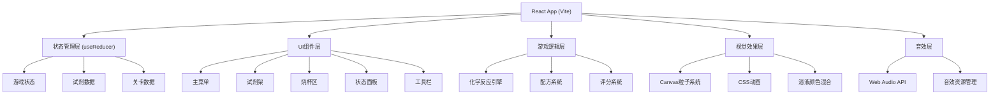

## 1. 架构设计


## 2. 技术描述
- **前端框架**：React@18 + TypeScript + Vite@5
- **样式方案**：TailwindCSS@3 + 自定义像素风格CSS
- **状态管理**：React useReducer + Context API
- **拖拽实现**：HTML5 Drag & Drop API + 自定义拖拽hooks
- **动画效果**：Canvas 2D API (粒子系统) + CSS Animations
- **音效系统**：Web Audio API + 程序化音效生成
- **数据持久化**：localStorage (关卡进度、保存配方)

## 3. 目录结构
```
src/
├── components/          # React组件
│   ├── MainMenu/       # 主菜单组件
│   ├── GameScreen/     # 游戏主界面
│   ├── ReagentRack/    # 试剂架
│   ├── Beaker/         # 烧杯组件
│   ├── StatusPanel/    # 状态面板
│   ├── Toolbar/        # 工具栏
│   └── common/         # 通用UI组件
├── hooks/              # 自定义Hooks
│   ├── useDragDrop.ts
│   ├── useAudio.ts
│   └── useGameState.ts
├── logic/              # 游戏逻辑
│   ├── chemistry.ts    # 化学反应引擎
│   ├── reactions.ts    # 反应配方数据
│   └── scoring.ts      # 评分系统
├── data/               # 静态数据
│   ├── reagents.ts     # 试剂定义
│   └── levels.ts       # 关卡定义
├── types/              # TypeScript类型定义
│   └── index.ts
├── utils/              # 工具函数
│   ├── colorMix.ts     # 颜色混合算法
│   └── particle.ts     # 粒子系统
└── App.tsx             # 应用入口
```

## 4. 路由定义
| Route | 页面 | 用途 |
|-------|------|------|
| `/` | 主菜单 | 游戏入口，模式选择 |
| `/challenge` | 挑战模式 | 关卡列表选择 |
| `/challenge/:levelId` | 挑战游戏 | 具体关卡游戏界面 |
| `/free` | 自由模式 | 自由实验界面 |

## 5. 核心数据模型

### 5.1 试剂数据模型
```typescript
interface Reagent {
  id: string;
  name: string;
  formula: string;       // 化学式
  type: 'acid' | 'base' | 'salt' | 'indicator' | 'water';
  color: string;         // 基础颜色 (HEX)
  ph: number;            // 初始pH值
  temperature: number;   // 初始温度
  concentration: number; // 浓度 mol/L
  pixelIcon: number[][]; // 像素图标数据
}
```

### 5.2 溶液状态模型
```typescript
interface Solution {
  volume: number;        // 总体积 mL
  ph: number;            // 当前pH值
  temperature: number;   // 当前温度
  color: string;         // 当前颜色
  components: {          // 成分列表
    reagentId: string;
    amount: number;      // 物质的量 mol
  }[];
  hasGas: boolean;       // 是否产生气体
  hasPrecipitate: boolean; // 是否有沉淀
  precipitateColor?: string;
}
```

### 5.3 反应配方模型
```typescript
interface Reaction {
  id: string;
  reactants: { reagentId: string; minRatio: number }[];
  products: {
    type: 'colorChange' | 'gas' | 'precipitate' | 'heat' | 'cool';
    value: any;
  }[];
  description: string;
}
```

### 5.4 关卡模型
```typescript
interface Level {
  id: string;
  name: string;
  description: string;
  objective: {
    type: 'ph' | 'color' | 'temperature' | 'precipitate' | 'gas';
    targetValue: any;
    tolerance: number;
  };
  availableReagents: string[];
  maxSteps: number;
  starThresholds: { three: number; two: number; one: number };
}
```

## 6. 化学反应引擎设计

### 6.1 pH值计算
- 基于酸碱中和原理：pH = -log[H⁺]
- 混合后计算总H⁺浓度和OH⁻浓度
- 中和反应后计算剩余离子浓度

### 6.2 颜色混合
- 使用RGB加权平均算法
- 考虑指示剂的pH变色范围
- 沉淀颜色单独叠加显示

### 6.3 温度变化
- 中和反应放热：ΔT = Q / (mc)
- 溶解热效应：根据试剂类型调整

## 7. 性能优化
- Canvas粒子系统使用对象池复用粒子对象
- 反应计算使用防抖，避免频繁重算
- 大列表使用虚拟滚动（如试剂选择列表）
- 音效使用AudioContext复用，避免重复创建

## 8. 像素风格实现方案
- 使用CSS `image-rendering: pixelated`
- 自定义像素字体 (Press Start 2P)
- Canvas绘制使用整数坐标
- 所有动画使用步进式动画，避免平滑插值
